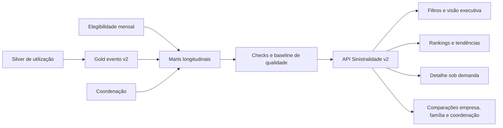

# Plano de implementação — evolução analítica da Sinistralidade 360

Data: 2026-07-16  
Status: proposta pronta para execução  
Baseline: contrato Gold v2 `1.0.0`, em shadow mode  
Versão-alvo inicial: contrato aditivo `1.1.0`

## 1. Resultado esperado

Evoluir a aba **Sinistralidade 360** de uma fotografia mensal para uma experiência
longitudinal, capaz de responder, com a mesma linguagem visual do restante do sistema:

- como custo, utilização, internações e população evoluem mês a mês;
- quais beneficiários, serviços, procedimentos, internações e prestadores mais usam e gastam;
- se os maiores utilizadores são recorrentes, novos ou estão reduzindo consumo;
- quais eventos explicam altas e quedas de custo;
- como saúde mental, pronto-socorro, internações, famílias e coordenação contribuem para o total;
- como empresas se comparam com denominadores equivalentes e períodos válidos;
- qual é a cobertura e a confiabilidade dos dados exibidos.

O objetivo não é colocar todos os gráficos na primeira dobra. A tela terá **resumo,
aprofundamento progressivo e detalhe sob demanda**, evitando transformar quantidade de
visualizações em ruído.

## 2. Escopo

### Incluído

1. Evolução mensal executiva com janelas de 3, 6, 12 e 24 meses.
2. Ranking longitudinal de beneficiários, serviços, procedimentos, internações e prestadores.
3. Detalhe mensal de beneficiário mascarado, sujeito a autorização específica.
4. Visões de internação, saúde mental, concentração, pronto-socorro, família e coordenação.
5. Comparação bimestral, ano contra ano e entre empresas.
6. Novos marts no Databricks, contratos, endpoints, componentes e testes.
7. Regras explícitas de fechamento, privacidade, qualidade, desempenho e publicação.
8. Padronização visual da Visão 360 com o design system atual do site.

### Não incluído nesta entrega

- cálculo atuarial de sinistralidade prêmio versus custo, enquanto prêmio oficial não existir;
- identificação por nome, CPF ou carteirinha em texto aberto;
- inferência de diagnóstico quando o CID não estiver presente e validado;
- integração operacional do serviço TUSS, mantida no roadmap até a retomada formal;
- predição de custo, risco clínico ou recomendação automática de cuidado;
- alteração retroativa de meses para `closed` sem o processo formal de fechamento.

## 3. Situação atual e gaps

| Capacidade | Situação atual | Gap para a evolução |
| --- | --- | --- |
| Custo e utilização mensal | `mart_sinistro_empresa_mes_v2` | Ampliar composição, variações, médias móveis e comparações |
| Top 10 mensal | `mart_top10_mes_v2` | É esparso; não acompanha entidade fora do Top 10 |
| Top 10 bimestral | `mart_top10_bimestre_v2` | Precisa de navegação e comparação de posição/recorrência |
| Saúde mental | Mart mensal já possui mês | API e UI usam pouco a série histórica disponível |
| Itens de pronto-socorro | Mart contém mês | API agrega o período e perde a curva mensal |
| Família antes/depois | Mart existente | Precisa de linha do tempo relativa e critérios homologados |
| Coordenação | Matriz existente | Precisa de série mensal, denominadores e exposição demográfica |
| Ano contra ano | Mart existente | Bloqueado até haver os seis meses fechados em ambos os anos |
| Custo por vida | Campo previsto | Histórico inválido até existirem snapshots mensais de elegibilidade |
| Internações | Campos e `episode_key` disponíveis | Falta visão longitudinal por episódio, grupo e prestador |
| Prestadores | Campos disponíveis na Gold | Falta mart, contrato e interface dedicados |
| Procedimentos/serviços | Campos disponíveis na Gold | Falta série densa por entidade e análise de volume versus custo |
| Detalhe individual | Ranking mascarado | Falta contrato de privacidade, permissão, auditoria e drawer |
| Multiempresa | Gold preparada | Falta homologação com arquivo real de outra empresa |

## 4. Decisões que devem ser fechadas antes da publicação

O desenvolvimento pode começar em shadow mode, mas nenhuma métrica afetada será publicada
como oficial sem as decisões abaixo.

| ID | Decisão | Recomendação de implementação | Responsável |
| --- | --- | --- | --- |
| GOV-01 | Custo oficial | Exibir `custo_bruto` como padrão e rotular explicitamente; custo líquido fica experimental | Negócio + dados |
| GOV-02 | Definição de internação | Contar episódios distintos por `episode_key`, não linhas de conta | Negócio + dados |
| GOV-03 | Período de 12 meses | Usar 12 últimos meses **fechados**; parcial apenas com aviso e permissão | Negócio |
| GOV-04 | Bimestre | Definir se é calendário ou janela móvel; manter ambos com nomes distintos se necessários | Negócio |
| GOV-05 | Entrada familiar | Homologar data e chave de família; não inferir titularidade ausente | Negócio + origem |
| GOV-06 | Exposição individual | Criar nível separado para agregados individuais e detalhe clínico | Segurança + negócio |
| GOV-07 | Diagnóstico principal | Só exibir com CID válido e cobertura mínima homologada | Clínico + dados |
| GOV-08 | Pequenos grupos | Suprimir ou agregar contagens abaixo do limite definido, recomendado `< 5` | Segurança |
| GOV-09 | Elegibilidade | Não calcular por vida em meses sem snapshot contemporâneo confiável | Negócio + dados |
| GOV-10 | Nova empresa | Homologar layout, empresa canônica, reconciliação e qualidade antes de abrir no seletor | Dados |

Mudança de definição de métrica já publicada exige versão de contrato `2.0.0`. Inclusão de
novos campos e escopos aditivos usa `1.1.0`.

## 5. Arquitetura de informação da tela

### 5.1 Cabeçalho analítico

Filtros persistentes e sincronizados com a URL:

- empresa;
- mês final;
- janela: 3, 6, 12 ou 24 meses;
- somente meses fechados ou incluir parcial;
- custo bruto ou outra base homologada;
- visão por pessoas, procedimentos, grupos, prestadores ou empresas.

O cabeçalho deve sempre mostrar:

- período efetivamente usado;
- status dos meses (`closed`, `partial`, `unknown`);
- data de atualização;
- cobertura de elegibilidade, CID e episódio;
- aviso quando a comparação não for válida.

### 5.2 Bloco A — evolução executiva

**KPIs do período**

- custo total;
- beneficiários utilizadores;
- serviços/quantidade;
- episódios de internação;
- famílias utilizadoras;
- custo por utilizador;
- custo por vida elegível, apenas quando válido;
- serviços por utilizador;
- internações por mil vidas, apenas quando válido.

**Visualizações**

1. Série mensal com seletor de métrica e comparação com período anterior.
2. Variação mês contra mês e ano contra ano.
3. Média móvel de três meses.
4. Composição de custo por tipo de evento em área ou colunas empilhadas.
5. Marcador visual de mês parcial, desconhecido ou com quebra de cobertura.

**Critério de aceite**

- o total de cada mês reconcilia com `gold_sinistro_evento_v2`;
- mês parcial nunca se mistura silenciosamente com mês fechado;
- tooltip mostra valor, variação, denominador e cobertura;
- o gráfico continua legível em 390, 1024 e 1440 pixels.

### 5.3 Bloco B — maiores utilizadores e gastadores

Tabela inspirada na preview Gold, mas integrada ao design da Visão 360:

- posição atual e variação de posição;
- código mascarado do beneficiário;
- faixa etária, vínculo e localização, conforme permissão;
- itens/serviços;
- episódios de internação;
- custo no período;
- participação no custo;
- recorrência entre os Top 10;
- minigráfico mensal de custo ou uso;
- evento principal comercial, somente no nível autorizado.

Controles de ranking:

- ordenar por custo, serviços ou internações;
- Top 10 ou Top 20;
- mês, bimestre ou janela de 12 meses fechados;
- destacar novos entrantes, recorrentes e quem saiu do Top 10.

**Critério de aceite**

- a série mensal do beneficiário não desaparece nos meses em que ele sai do Top 10;
- participação usa o mesmo custo e período do denominador executivo;
- posição e recorrência são calculadas após o gate de período;
- nenhuma identidade direta é retornada pela API.

### 5.4 Bloco C — detalhe do beneficiário

Ao selecionar uma linha, abrir drawer lateral sem navegar para outra página:

- custo, serviços e internações por mês;
- composição por tipo de evento;
- principais procedimentos e grupos de serviço;
- principais prestadores;
- linha do tempo de internações com duração e custo;
- posição no ranking em cada mês;
- comparação do beneficiário com a mediana da empresa, quando permitida.

Regras:

- carregar sob demanda;
- exigir permissão individual específica;
- auditar acesso com usuário, empresa, pessoa mascarada, período e horário;
- não retornar CID, descrição clínica ou evento individual para perfis sem autorização clínica;
- não expor nome, CPF ou carteirinha original.

### 5.5 Bloco D — serviços e procedimentos

Rankings independentes:

- mais utilizados;
- maior custo total;
- maior custo médio;
- maior crescimento mensal;
- novos no período;
- maior contribuição para o aumento de custo.

Visualizações:

1. Tabela com curva mensal por procedimento ou grupo.
2. Pareto de custo e participação acumulada.
3. Dispersão: volume no eixo X, custo médio no eixo Y e custo total no tamanho.
4. Série mensal dos itens selecionados, com até cinco comparações simultâneas.
5. Separação de linha de conta, quantidade de serviço e episódio para evitar dupla leitura.

### 5.6 Bloco E — internações e saúde mental

**KPIs**

- episódios;
- beneficiários internados;
- custo total;
- custo médio por episódio;
- duração mediana e percentil 90;
- internações por mil vidas, quando válido;
- reinternação, somente após homologar janela e definição.

**Visualizações**

- evolução mensal geral e de saúde mental;
- ranking por agrupamento de internação;
- ranking de prestadores de internação;
- custo versus duração por episódio agregado;
- participação e concentração de saúde mental;
- composição por faixa etária, vínculo e empresa sem exposição individual.

Saúde mental permanece visualmente separada dos demais eventos e deve mostrar o critério
utilizado para classificação.

### 5.7 Bloco F — prestadores e rede

- custo, utilizadores, serviços e internações por prestador;
- custo médio por episódio e por utilizador;
- participação e participação acumulada;
- curva mensal;
- rede credenciada versus reembolso;
- crescimento de volume, custo e ticket médio;
- filtros por tipo de evento e especialidade.

### 5.8 Bloco G — concentração

- participação de Top 1, Top 5, Top 10 e Top 10% no custo;
- evolução mensal da concentração;
- quantidade de beneficiários responsável por 50% e 80% do custo;
- recorrência dos maiores utilizadores entre meses;
- separação de internação, saúde mental e demais eventos.

### 5.9 Bloco H — comparação entre empresas

- custo total e participação no total do operador;
- custo por utilizador;
- custo por vida elegível, quando válido;
- serviços por utilizador;
- internações por mil vidas;
- composição por evento;
- variação mensal e ano contra ano.

Valores absolutos e normalizados devem aparecer lado a lado. O sistema não deve ranquear
empresas por custo por vida se qualquer denominador do período estiver inválido.

### 5.10 Bloco I — família e coordenação

- linha do tempo relativa antes/depois da entrada do grupo familiar;
- custo, uso, internações e mudança de evento;
- coortes por mês de entrada;
- fatura versus coordenação: utiliza e é coordenado, utiliza sem coordenação, não utiliza e é
  coordenado, não utiliza e não é coordenado;
- evolução mensal e cortes demográficos dos gaps;
- cobertura da ponte familiar e população sem associação confiável.

### 5.11 Bloco J — pronto-socorro

- itens e grupos mais usados em episódios de pronto-socorro;
- custo e quantidade por mês;
- quantidade por episódio;
- recorrência por beneficiário em forma agregada;
- associação explícita ao `episode_key` de pronto-socorro;
- comparação entre itens, como medicamentos, exames e materiais.

## 6. Arquitetura técnica-alvo



Princípios:

- Gold continua no grão de evento/linha; marts são derivados, não fontes paralelas;
- toda série longitudinal preserva `company_key` e `month_key`;
- ranking é calculado sobre marts densos, não somente sobre linhas previamente classificadas
  como Top 10;
- períodos e denominadores são resolvidos antes do cálculo;
- detalhe individual não é incluído no payload da visão geral;
- objetos novos nascem em shadow mode e só substituem a leitura após reconciliação.

## 7. Plano Databricks

### 7.1 Reutilização

Reutilizar sem duplicar regra:

- `gold_sinistro_evento_v2` como fonte analítica;
- `mart_sinistro_empresa_mes_v2` para o resumo mensal;
- `mart_saude_mental_internacao_v2` para a série de saúde mental;
- marts atuais de bimestre, família, coordenação e ano contra ano;
- control tables, manifest, período, qualidade e elegibilidade já existentes.

### 7.2 Novos objetos

Criar `databricks/sinistralidade/sql/008_longitudinal_marts.sql` com os objetos abaixo.

| Mart | Grão | Finalidade e campos mínimos |
| --- | --- | --- |
| `mart_evento_empresa_mes_v2` | empresa + mês + tipo de evento | custo, linhas, quantidade, usuários, episódios e participação |
| `mart_pessoa_mes_v2` | empresa + mês + pessoa | custo, linhas, quantidade, episódios, eventos, prestadores e família |
| `mart_procedimento_mes_v2` | empresa + mês + procedimento | descrição comercial, grupo, quantidade, linhas, usuários, episódios, custo e custo médio |
| `mart_internacao_mes_v2` | empresa + mês + critério mental | episódios, usuários, custo, duração mediana/P90 e cobertura |
| `mart_internacao_grupo_mes_v2` | empresa + mês + agrupamento | episódios, usuários, custo, duração e prestadores |
| `mart_prestador_mes_v2` | empresa + mês + prestador | custo, usuários, quantidade, episódios, rede/reembolso e ticket médio |
| `mart_concentracao_mes_v2` | empresa + mês | Top 1/5/10/10%, pessoas para 50%/80% e recorrência |
| `mart_ps_item_mes_v2` | empresa + mês + procedimento/grupo | episódios PS, usuários, quantidade, custo e quantidade por episódio |
| `mart_familia_mes_relativo_v2` | empresa + coorte + mês relativo | famílias, pessoas, uso, custo, internações e composição de evento |
| `mart_coordenacao_empresa_mes_v2` | empresa + mês + quadrante | pessoas, utilizadores, custo, eventos e cortes demográficos permitidos |

O benchmark entre empresas deve ser derivado do mart mensal e da elegibilidade, evitando um
novo mart enquanto o desempenho atender ao SLA.

### 7.3 Regras de cálculo

- `internacoes = count(distinct episode_key)` com episódio válido;
- `usuarios = count(distinct person_key)`;
- `familias = count(distinct family_key)` somente para chaves confiáveis;
- participação sempre usa o mesmo recorte e a mesma definição de custo do numerador;
- custo médio por internação divide pelo número de episódios, não por linhas;
- crescimento não é calculado quando o período anterior é zero ou ausente; retornar estado
  explícito `new`, `not_comparable` ou `valid`;
- rankings usam função determinística com desempate por chave estável;
- uma entidade sem consumo em determinado mês recebe zero na série dentro da janela, não é
  removida do retorno;
- meses sem cobertura não são preenchidos com zero;
- dados demográficos usam a classificação do evento/snapshot definida no contrato.

### 7.4 Materialização e desempenho

Começar com views em homologação para acelerar validação. Materializar em Delta os marts de
pessoa, procedimento e prestador se o p95 da consulta exceder o orçamento da API.

Quando materializados:

- particionar ou clusterizar por `company_key` e `month_key` conforme cardinalidade real;
- processar incrementalmente somente meses alterados no manifest;
- registrar versão do contrato e `quality_run_id` em cada publicação;
- limitar APIs a 24 meses e Top 20 por consulta interativa;
- carregar detalhes individuais somente após seleção.

### 7.5 Qualidade e baseline

Criar:

- `009_longitudinal_quality_checks.sql`;
- `010_longitudinal_baseline.sql`.

Checks obrigatórios:

1. unicidade no grão de cada mart;
2. soma mensal de custo versus Gold, com tolerância monetária documentada;
3. contagem de usuários e episódios versus cálculo direto da Gold;
4. participação total próxima de 100% por recorte completo;
5. nenhuma empresa ou mês nulo;
6. ranking determinístico e sem posição duplicada indevida;
7. densidade correta das séries selecionadas;
8. cobertura de `person_key`, `episode_key`, procedimento, prestador, CID e família;
9. datas suspeitas isoladas do período oficial;
10. denominadores de elegibilidade contemporâneos;
11. reconciliação Preview Gold versus V2 para a mesma janela e definição;
12. execução completa com ao menos uma empresa adicional homologada.

## 8. Contratos e API

### 8.1 Novos escopos

Estender `src/contracts/sinistralidade-v2.ts` e a rota com:

| Escopo | Uso |
| --- | --- |
| `timeline` | KPIs e evolução executiva |
| `event-mix` | composição mensal por evento |
| `top-users-window` | ranking denso por janela e critério |
| `user-detail` | detalhe individual autorizado e sob demanda |
| `procedure-trends` | rankings e séries de procedimentos/grupos |
| `hospitalization-trends` | internações gerais, grupos e saúde mental |
| `provider-trends` | desempenho e evolução de prestadores |
| `concentration` | Top N, percentis e recorrência |
| `company-benchmark` | comparação absoluta e normalizada |
| `family-timeline` | coortes antes/depois |
| `care-timeline` | quadrantes de coordenação no tempo |
| `ps-trends` | itens de pronto-socorro no tempo |

### 8.2 Parâmetros comuns

- `company_key` obrigatório, exceto benchmark autorizado;
- `end_month` obrigatório;
- `window_months` em `3 | 6 | 12 | 24`;
- `include_partial=false` por padrão;
- `ranking_by` em `cost | services | hospitalizations | growth`;
- `limit` em `10 | 20`;
- `entity_key` somente nos escopos de detalhe;
- filtros opcionais de evento, saúde mental, rede e especialidade;
- `detail_level=aggregate | individual` resolvido também pela permissão do servidor.

### 8.3 Envelope de resposta

Todo escopo deve retornar:

- versão do contrato;
- empresa e janela solicitada;
- janela efetivamente calculada;
- status de cada mês;
- métricas e unidades;
- cobertura e advertências;
- origem, `quality_run_id` e atualização;
- estado `valid`, `partial`, `blocked` ou `not_comparable`.

O frontend não deve deduzir se uma métrica é válida usando apenas `null`.

### 8.4 Refatoração da rota

Antes de adicionar todos os escopos, dividir a lógica hoje concentrada em
`src/server/routes/sinistralidade-v2.ts`:

```text
src/server/sinistralidade/
  permissions.ts
  period-gate.ts
  serializers.ts
  query-runner.ts
  queries/
    timeline.ts
    rankings.ts
    procedures.ts
    hospitalizations.ts
    providers.ts
    concentration.ts
    family-care.ts
```

A rota permanece como adaptador HTTP e não concentra SQL, autorização e transformação.

## 9. Segurança, privacidade e auditoria

### Níveis de acesso

1. **Agregado empresarial**: métricas sem identificação individual.
2. **Ranking individual mascarado**: código opaco e totais de utilização.
3. **Detalhe individual clínico**: procedimentos, eventos, prestadores e internações.

Criar uma permissão explícita para os níveis 2 e 3; não reutilizar acesso administrativo
genérico como autorização clínica implícita.

Controles:

- aplicar company scope no servidor e no SQL;
- nunca aceitar `company_key` somente como filtro de interface;
- registrar cada consulta individual em log de auditoria;
- remover campos sensíveis antes da serialização, não apenas no componente;
- aplicar supressão de pequenos grupos a perfis externos;
- proibir cache compartilhado de respostas individuais;
- evitar CID no ranking; liberar apenas no detalhe clínico aprovado;
- manter MDS sem acesso individual por padrão;
- testar tentativas de acesso cruzado entre empresas.

## 10. Implementação frontend

### 10.1 Estrutura

Refatorar `SinistralidadeV2Tab.tsx` para que ele coordene a página, sem concentrar todos os
blocos:

```text
src/features/sinistralidade/
  SinistralidadeV2Tab.tsx
  SinistralidadeV2Tab.module.css
  hooks/
    useSinistralidadeFilters.ts
    useSinistralidadeScope.ts
  components/
    AnalyticsHeader.tsx
    CoverageNotice.tsx
    ExecutiveKpis.tsx
    MonthlyEvolutionChart.tsx
    EventMixChart.tsx
    TopUsersTable.tsx
    UserDetailDrawer.tsx
    ProcedureAnalysis.tsx
    HospitalizationAnalysis.tsx
    ProviderAnalysis.tsx
    ConcentrationAnalysis.tsx
    CompanyBenchmark.tsx
    FamilyCareAnalysis.tsx
    PsItemAnalysis.tsx
```

### 10.2 Sistema visual

- usar os mesmos tokens de cor, tipografia, espaçamento, borda, raio e sombra do site;
- manter cards e cabeçalhos com a mesma densidade das outras telas;
- usar laranja apenas como destaque, não como cor dominante de todos os gráficos;
- cores semânticas consistentes para custo, uso, internação, saúde mental e parcialidade;
- legenda comercial e tooltip em português em todos os campos;
- unidades sempre visíveis: `R$`, pessoas, serviços, episódios, dias, `%`;
- tabela com cabeçalho fixo, ordenação, foco de teclado e rolagem horizontal controlada.

### 10.3 Biblioteca de gráficos

Abrir uma decisão técnica curta entre uma biblioteca React e primitives SVG. A recomendação
inicial é uma biblioteca React acessível e responsiva para linhas, empilhados, Pareto e
dispersão, desde que passe por:

- compatibilidade com a versão atual de React/Next;
- bundle aceitável;
- renderização SSR sem erro;
- tooltips acessíveis;
- responsividade;
- capacidade de seguir os tokens visuais do site.

Não implementar quatro bibliotecas diferentes nem depender do Chart.js legado por CDN dentro
da aba React.

### 10.4 Comportamento de carregamento

- carregar primeiro metadata, filtros e resumo;
- carregar blocos abaixo da dobra de forma independente;
- buscar detalhe e séries selecionadas sob demanda;
- preservar resultados anteriores durante troca de filtro, com indicação de atualização;
- fornecer estados de loading, vazio, bloqueado, parcial e erro por bloco;
- permitir retry sem recarregar a página inteira.

### 10.5 Controle de densidade

Para comportar muitas análises sem sobrecarregar a tela:

- resumo executivo sempre aberto;
- grupos temáticos em navegação secundária ou acordeões persistentes;
- cada ranking mostra Top 10 e expande sob demanda;
- no máximo cinco séries simultâneas em um gráfico;
- drawer para detalhe individual;
- filtros globais no topo e filtros locais dentro do bloco;
- opção de tabela complementar a todo gráfico relevante.

## 11. Testes e validação

### Dados

- testes de grão, reconciliação, cobertura e período no Databricks;
- amostra manual de episódios de internação e associação de itens de PS;
- comparação com Preview Gold usando exatamente o mesmo período e definição;
- execução com Azul e uma segunda empresa real;
- verificação de meses ausentes, duplicados, parciais e reprocessados.

### Contratos e servidor

- parsing de todos os novos parâmetros;
- bloqueio `409` para período não fechado sem autorização;
- company scope e permissão individual;
- serialização de estados inválidos sem ambiguidade;
- cache separado por empresa, janela, escopo, filtros e nível de acesso;
- limites máximos de janela e ranking;
- tentativa de acesso a pessoa de outra empresa;
- auditoria gerada somente após acesso autorizado.

### Interface

- unitários dos formatadores e estados de comparação;
- componentes com loading, vazio, bloqueado, parcial, erro e sucesso;
- interação de filtros, ordenação, seleção de série e drawer;
- navegação por teclado e texto alternativo/tabela para gráficos;
- testes responsivos em 390, 768, 1024 e 1440 pixels;
- regressão visual contra os componentes do restante do site;
- E2E do fluxo empresa → período → ranking → beneficiário → retorno.

### Performance

Orçamentos iniciais a validar em homologação:

- resumo e timeline: p95 de API até 3 segundos sem cache;
- resposta em cache: p95 até 1 segundo;
- detalhe individual: p95 até 3 segundos;
- troca visual de filtro: feedback imediato, mesmo durante nova busca;
- nenhuma consulta interativa sem limite de empresa e período;
- página inicial não baixa todas as séries de detalhe.

## 12. Observabilidade

Registrar por consulta:

- escopo;
- empresa;
- janela e quantidade de meses;
- inclusão ou não de parcial;
- duração;
- linhas retornadas;
- cache hit/miss;
- versão de contrato e `quality_run_id`;
- estado de cobertura;
- erro Databricks normalizado, sem SQL ou dado sensível no cliente.

Criar alertas para:

- falha de reconciliação;
- período reaberto ou reprocessado;
- queda abrupta de cobertura de pessoa, episódio, prestador ou procedimento;
- aumento de latência;
- tentativa repetida de acesso fora do company scope;
- consulta individual sem registro de auditoria.

## 13. Estratégia de rollout

Feature flags propostas:

- `SINISTRALIDADE_360_LONGITUDINAL_ENABLED`;
- `SINISTRALIDADE_360_INDIVIDUAL_RANKING_ENABLED`;
- `SINISTRALIDADE_360_INDIVIDUAL_DETAIL_ENABLED`;
- `SINISTRALIDADE_360_COMPANY_BENCHMARK_ENABLED`.

Etapas:

1. **Shadow Databricks**: criar marts, checks e baseline sem mudar a API pública.
2. **Homologação técnica**: API `1.1.0`, dados sintéticos e empresa atual.
3. **Homologação de negócio**: reconciliação com Preview Gold e aprovação das legendas.
4. **Piloto interno**: evolução executiva, procedimentos e internações.
5. **Piloto individual restrito**: ranking e drawer somente para grupo autorizado.
6. **Teste multiempresa**: arquivo real adicional e isolamento de scopes.
7. **Produção gradual**: ativação por empresa e por bloco.
8. **Estabilização**: acompanhar latência, qualidade e uso antes de remover a experiência antiga.

Rollback consiste em desativar as flags e manter a aba atual consumindo os escopos `1.0.0`.
Nenhum mart v2 deve ser apagado durante a estabilização.

## 14. Sequência de execução

As estimativas são de esforço de engenharia, não incluem espera por arquivo, decisão de
negócio, acesso Databricks ou homologação externa.

| Fase | Entregas | Dependências | Esforço estimado |
| --- | --- | --- | --- |
| 0. Governança | GOV-01 a GOV-10, legenda e wireframe funcional | Negócio, segurança, clínico | 2–4 dias |
| 1. Fundação longitudinal | Scripts 008–010, séries densas e baseline | Fase 0 parcial | 6–9 dias |
| 2. Contrato e API | v1.1.0, refatoração, gates, cache e permissões | Fase 1 | 5–8 dias |
| 3. Resumo executivo | filtros, KPIs, timeline, event mix e cobertura | Fase 2 | 4–6 dias |
| 4. Top utilizadores | ranking, recorrência, sparkline e drawer | Fases 2–3, GOV-06 | 6–9 dias |
| 5. Uso assistencial | procedimentos, internações, saúde mental e prestadores | Fases 1–3 | 7–10 dias |
| 6. Análises ampliadas | concentração, empresas, família, coordenação e PS | Fases 1–3, dados externos | 7–11 dias |
| 7. Hardening e rollout | E2E, visual, performance, auditoria e publicação | Todas | 5–8 dias |

Total sequencial estimado: **42–65 dias de engenharia**. Com trilhas de dados e frontend em
paralelo após o contrato, a execução tende a caber em **5 a 8 semanas**, excluindo bloqueios
externos.

## 15. Backlog executável

### P0 — necessário para começar e publicar o núcleo

- [ ] `GOV-01` a `GOV-10`: registrar decisões e responsáveis.
- [ ] `DATA-01`: criar mart denso de pessoa por mês.
- [ ] `DATA-02`: criar marts de evento, procedimento, internação e prestador.
- [ ] `DATA-03`: criar checks e baseline longitudinal.
- [ ] `DATA-04`: reconciliar internações Preview Gold versus `episode_key`.
- [ ] `API-01`: publicar contrato aditivo `1.1.0`.
- [ ] `API-02`: refatorar rota por escopo.
- [ ] `API-03`: implementar timeline, event mix e procedure trends.
- [ ] `SEC-01`: criar permissões individual e clínica.
- [ ] `SEC-02`: implementar auditoria e testes de company scope.
- [ ] `UI-01`: implementar cabeçalho, cobertura e estados de período.
- [ ] `UI-02`: implementar KPIs e evolução executiva.
- [ ] `UI-03`: implementar composição por evento.
- [ ] `QA-01`: testar reconciliação, responsividade e regressão visual.

### P1 — maior valor analítico após o núcleo

- [ ] `API-04`: top users window e user detail.
- [ ] `UI-04`: tabela longitudinal de beneficiários.
- [ ] `UI-05`: drawer individual autorizado.
- [ ] `API-05`: hospitalization e provider trends.
- [ ] `UI-06`: internações e saúde mental.
- [ ] `UI-07`: serviços, procedimentos e prestadores.
- [ ] `DATA-05`: mart e métricas de concentração.
- [ ] `UI-08`: concentração e recorrência.
- [ ] `QA-02`: E2E ranking → detalhe e teste de vazamento entre empresas.

### P2 — depende mais de fonte e maturidade

- [ ] `DATA-06`: homologar empresa adicional.
- [ ] `API-06`: company benchmark com denominadores válidos.
- [ ] `DATA-07`: linha do tempo familiar após ponte confiável.
- [ ] `API-07`: family e care timeline.
- [ ] `UI-09`: empresas, família e coordenação.
- [ ] `API-08`: PS trends preservando o mês.
- [ ] `UI-10`: itens de pronto-socorro ao longo do tempo.
- [ ] `ROADMAP-01`: reavaliar integração TUSS Leo → Bronze → Gold.

## 15.1 Checklist de execução (atualizado durante a implementação)

Status: `[x]` concluído · `[~]` implementado em shadow mode/gate fechado · `[!]` bloqueado externamente · `[ ]` pendente

### Fundação Databricks

- [x] `008_longitudinal_marts.sql` com os dez marts longitudinais (aplicado em shadow mode; gates aprovados em `longitudinal-baseline-2026-07-16`)
- [x] `009_longitudinal_quality_checks.sql` (todos os checks executados com zero violações)
- [x] `010_longitudinal_baseline.sql` (8/8 checks `passed` registrados em `sinistralidade_quality_run_v2`)
- [x] Registro no deploy (`scripts/deploy-sinistralidade-v2.mjs`) e README

### Contratos e API

- [x] Contrato `1.1.0` com os doze novos escopos e envelope completo
- [x] Refatoração da rota em módulos `src/server/sinistralidade/`
- [x] Company scope no servidor e no SQL para todos os escopos novos
- [x] Permissões individuais (ranking e detalhe clínico) e auditoria de acesso
- [x] Feature flags de rollout (todas desligadas por padrão)

### Frontend

- [x] Refatoração de `SinistralidadeV2Tab` em componentes e hooks (experiência 1.0.0 preservada como fallback)
- [x] Cabeçalho analítico, cobertura e estados de período
- [x] KPIs executivos e evolução mensal (MoM, YoY, média móvel, mês parcial sinalizado)
- [x] Composição mensal por evento
- [~] Top beneficiários longitudinal com sparkline (pronto; exposto somente com flag + permissão)
- [~] Drawer individual autorizado (pronto; gate de permissão clínica fechado por padrão)
- [x] Serviços e procedimentos (rankings, Pareto, dispersão, série mensal)
- [x] Internações e saúde mental (episódios distintos por `episode_key`)
- [x] Prestadores e rede/reembolso
- [x] Concentração (Top 1/5/10/10%, pessoas para 50%/80%, recorrência)
- [~] Comparação entre empresas (pronto em shadow; `[!]` bloqueado externamente até homologar arquivo real de segunda empresa)
- [~] Família antes/depois (linha do tempo relativa; limitado à ponte familiar atual)
- [x] Fatura × coordenação por mês com supressão de pequenos grupos para MDS
- [x] Itens de pronto-socorro ao longo do tempo

### Qualidade

- [x] Testes de contrato, período, permissão, serialização e isolamento (31 unitários aprovados)
- [x] Lint, typecheck, testes e build de produção aprovados
- [x] Documentação e estado de implementação atualizados

Nota: o teste E2E `dashboard.spec.ts` falha na aba “Petit Comitê MDS” também no
commit base (falha pré-existente, não relacionada a esta entrega).

## 16. Critérios de aceite globais

A evolução só é considerada concluída quando:

1. todas as métricas possuem nome comercial, fórmula, unidade, grão e regra de período;
2. todos os gráficos têm tabela ou alternativa acessível;
3. todos os totais reconciliam com a Gold dentro da tolerância aprovada;
4. meses parciais, desconhecidos ou sem denominador aparecem claramente;
5. a série não omite meses válidos nem transforma ausência de cobertura em zero;
6. ranking e detalhe individual respeitam permissão, escopo e auditoria;
7. nenhum dado direto de identificação sai da API;
8. a tela segue os tokens e componentes visuais do restante do site;
9. os fluxos principais funcionam em desktop, tablet e mobile;
10. Azul e pelo menos uma empresa adicional passam pelos mesmos gates;
11. performance atende ao orçamento definido;
12. documentação, contrato, SQL, testes e baseline são publicados juntos.

## 17. Riscos e mitigação

| Risco | Impacto | Mitigação |
| --- | --- | --- |
| Nenhum mês formalmente fechado | Comparações oficiais bloqueadas | Shadow mode e CTA operacional para fechamento |
| Elegibilidade histórica insuficiente | Custo por vida inválido | Ocultar denominador e mostrar cobertura, sem retroagir snapshot |
| Top 10 atual esparso | Evolução incorreta | Mart denso por pessoa/procedimento antes do ranking |
| Definições Preview Gold e V2 diferentes | Números divergentes | Planilha de reconciliação por fórmula, período e grão |
| Exposição clínica individual | Risco LGPD e acesso indevido | Permissão própria, auditoria, mascaramento e supressão |
| Ponte familiar ausente | Antes/depois incorreto | Manter bloco bloqueado com cobertura explícita |
| Arquivo de nova empresa diferente | Quebra da promessa multiempresa | Homologação de schema, manifest e contrato de entrada |
| Muitos gráficos | Baixa compreensão e desempenho | Progressive disclosure, carregamento por bloco e Top N |
| Consultas de alta cardinalidade | Latência e custo Databricks | Marts materializados, limites e cache por período |
| TUSS incompleto | Agrupamento inconsistente | Descrição comercial versionada e cobertura visível |

## 18. Indicadores de sucesso

- usuário identifica em até três interações o que mais elevou o custo de um mês;
- usuário acompanha um Top beneficiário, procedimento ou prestador ao longo de 12 meses;
- divergência de custo mensal entre mart e Gold dentro da tolerância aprovada;
- 100% dos blocos mostram período, unidade e estado de cobertura;
- zero acesso individual fora da empresa ou da permissão autorizada;
- redução de consultas manuais para explicar Top usuários e internações;
- p95 dos escopos principais dentro do orçamento;
- segunda empresa processada sem SQL ou componente específico por empresa.

## 19. Primeira entrega recomendada

O primeiro corte publicável deve conter:

1. cabeçalho de período e cobertura;
2. KPIs e evolução mensal executiva;
3. composição mensal por evento;
4. procedimentos mais usados e mais caros com curva mensal;
5. internações gerais e saúde mental com curva mensal;
6. ranking longitudinal mascarado sem detalhe clínico;
7. reconciliação, testes responsivos e feature flag.

Esse corte já atende a principal necessidade de “ver a evolução de meses” e prepara a base
correta para o drawer individual, prestadores, concentração, multiempresa e família.

## 20. Arquivos afetados

### Existentes

- `docs/sinistralidade/glossario-comercial.md`
- `docs/sinistralidade/metricas-v2.yaml`
- `docs/sinistralidade/contrato-silver-gold-v2.md`
- `databricks/sinistralidade/sql/004_analytics_marts.sql`
- `databricks/sinistralidade/sql/005_quality_checks.sql`
- `src/contracts/sinistralidade-v2.ts`
- `src/server/routes/sinistralidade-v2.ts`
- `src/features/sinistralidade/SinistralidadeV2Tab.tsx`
- `src/features/sinistralidade/SinistralidadeV2Tab.module.css`

### Novos

- `databricks/sinistralidade/sql/008_longitudinal_marts.sql`
- `databricks/sinistralidade/sql/009_longitudinal_quality_checks.sql`
- `databricks/sinistralidade/sql/010_longitudinal_baseline.sql`
- módulos de `src/server/sinistralidade/`
- hooks e componentes de `src/features/sinistralidade/`
- testes de contrato, servidor, componentes e E2E correspondentes.
